## Objective

- Survey definitions of AI, linking them with biology and academic tribes working on AI over past, present and future.

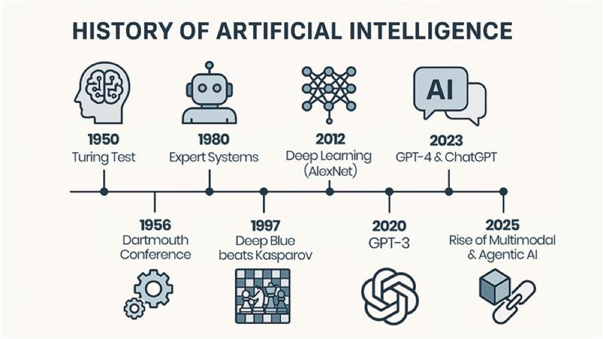

Seventy-five years of moving the goalposts — most of these names recur tonight

---

## Acknowledgements

- **Leonardo Donando**
- **Jonathan Florez Giraldo**
- **Alex Kuznetsov**
- **Delany Adom**
- **Andrei Alain González Galeano**
- **Pedro Domingos** — for *The Master Algorithm* and the five tribes

*With gratitude for their contributions.*

::: {.notes}
Thank these five by name and say a warm sentence about what each contributed before moving on. Keep it brief and heartfelt — a moment of gratitude, not a list to rush through. Double-check the name spellings and pronunciations ahead of time.
:::

---

## Four Threads

- **Intelligence is Task Solving** by learning
- **Minds run on prediction** — animal, human, machine alike
- **"AI" is an Ambiguous Term** — today, a marketing label for LLMs
- **Human intelligence is Sample Efficient Novel Task Solving** — written first in our biology

- Good prediction indicates learning

::: {.notes}
These four threads recur all evening — flag them now so people can track them. Problem-solving by learning is the frame, prediction is the mechanism, "AI" being ambiguous is the caution, and sample-efficient novel problem solving is the yardstick. Tell the audience: whenever I say "intelligence," hold me to that last definition. Point back here each time a thread resurfaces.
:::

---

## Outline

:::: {style="font-size:0.92em;"}
- I Minds: consciousness & animals
- II Human intelligence as machine learning
- III "AI": an ambiguous term
- *— coffee —*
- IV Generative AI & LLMs
- V The five tribes
- VI State of the art
- VII What we want from AGI
- VIII The future
::::

::: {.notes}
Roadmap slide — keep it brief, roughly 20 seconds. Note the coffee break sits between III and IV so people can pace themselves. Sections I–III build the conceptual frame; IV–VIII are the payoff. Don't read every line aloud; just orient them.
:::

---

## I. Minds: Consciousness & Animals {.section-divider}

## Sentience vs. Sapience

:::: {.columns}
::: {.column width="56%"}
- **Sentience** — to feel, to experience (qualia)
- **Sapience** — to judge, to act with wisdom
- Today's AI mimics sapience, shows no sentience
- That asymmetry is the hard problem
:::
::: {.column width="44%"}
<svg viewBox="0 0 260 230" width="100%" style="max-width:340px" font-family="sans-serif">
  <line x1="42" y1="200" x2="244" y2="200" stroke="#8b919a" stroke-width="1.5"/>
  <line x1="42" y1="200" x2="42" y2="18" stroke="#8b919a" stroke-width="1.5"/>
  <text x="145" y="223" fill="#b9bdc6" font-size="11" text-anchor="middle">Sapience — judgement →</text>
  <text x="16" y="110" fill="#b9bdc6" font-size="11" text-anchor="middle" transform="rotate(-90 16 110)">Sentience — feeling →</text>
  <circle cx="205" cy="46" r="7" fill="#f0a868"/>
  <text x="197" y="40" fill="#e6e6e9" font-size="11" text-anchor="end">Human</text>
  <circle cx="82" cy="66" r="7" fill="#63b3a6"/>
  <text x="94" y="62" fill="#e6e6e9" font-size="11">Animal</text>
  <circle cx="208" cy="186" r="7" fill="#e06c75"/>
  <text x="200" y="178" fill="#e6e6e9" font-size="11" text-anchor="end">Today's AI</text>
</svg>
:::
::::

::: {.notes}
Define the two words carefully — audiences conflate them. Sentience is feeling (qualia), sapience is wise judgement. Chalmers' "hard problem" is why there's subjective experience at all. The asymmetry to stress: our machines are climbing the sapience axis while showing zero evidence on the sentience axis, and we have no test to settle it either way.
:::

---

## Self-Awareness

:::: {.columns}
::: {.column width="52%"}
- Introspection — the self as distinct from the world
- Rodin's *Thinker*: a mind watching itself think
- Not the same as intelligence, nor consciousness
- Perhaps a prerequisite for both
:::
::: {.column width="48%"}

<a href="https://en.wikipedia.org/wiki/The_Thinker" target="_blank" rel="noopener" style="text-decoration:none;">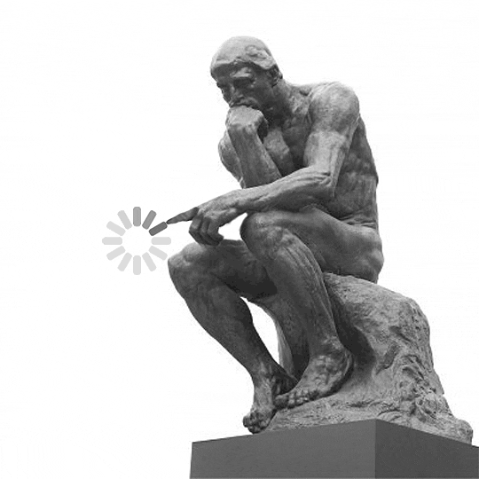</a>
<a href="https://en.wikipedia.org/wiki/Mirror_test" target="_blank" rel="noopener" style="text-decoration:none;">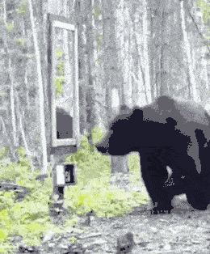</a>

A mind watching itself think — and three meeting themselves: bear, infant, child pass the mirror test

:::
::::

::: {.notes}
Use the Rodin as the hook — a mind watching itself think — then point down to the mirror clips for the flip side: a mind meeting itself. The mirror test is the real experiment here: a bear, a human infant, and an older child, and only some of them work out that the reflection is *them*. Self-recognition is not automatic, it develops, and it is not uniquely human — which is exactly the uncomfortable, useful point. Keep the key distinction crisp: self-awareness, intelligence, and consciousness are three separable things, and we tend to bundle them. "Perhaps a prerequisite" is deliberately hedged — flag it as an open question, not a claim.
:::

---

## A Ladder of Agency

1. Thermostat / bacterium — reactive feedback
2. Dog — bonding, mapping, goals
3. Octopus — distributed cognition, tool use
4. Dolphin — self-recognition, communication
5. Human — metacognition, culture

::: {.notes}
Big caveat first, and say it out loud: this is a teaching device, not a real taxonomy — a ladder implies a single axis, and that's exactly the assumption the animals are about to demolish. Walk up it quickly. The point of building it is to knock it down: intelligence isn't linear, and "higher" is doing a lot of unearned work here.
:::

---

## Primate: Our Closest Relative

:::: {.columns}
::: {.column width="56%"}
- Shared ancestry — chimps, bonobos ~6–7 Mya
- Primate cognition: a rough draft of ours
- The differences are as instructive as the likenesses
:::
::: {.column width="44%"}
[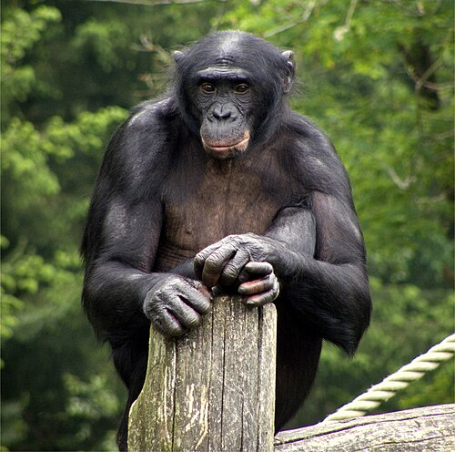{width="100%" style="border-radius:10px;"}](https://en.wikipedia.org/wiki/Bonobo){target="_blank" rel="noopener"}

Bonobo
:::
::::

::: {.notes}
Chimps and bonobos share a common ancestor with us roughly 6–7 million years ago. They give us tool use, coalition politics, and partial theory of mind — a rough draft of our cognition. But lean on the last bullet: what they lack (cumulative culture, language) tells us as much about what makes us us as what they share.
:::

---

## Octopus: Intelligence Reinvented

:::: {.columns}
::: {.column width="56%"}
- Last common ancestor ~550 Mya
- Evolved **completely independently** of ours
- A true natural experiment in cognition
- Similar solutions → convergence is real
:::
::: {.column width="44%"}

<svg viewBox="0 0 260 200" width="100%" style="max-width:330px" font-family="sans-serif">
  <text x="130" y="16" fill="#b9bdc6" font-size="10" text-anchor="middle">~500M neurons</text>
  <!-- arms: hub to 8 ganglia -->
  <g stroke="#f0a868" stroke-width="1.5" opacity="0.7">
    <line x1="130" y1="60" x2="219" y2="92"/>
    <line x1="130" y1="60" x2="203" y2="121"/>
    <line x1="130" y1="60" x2="177" y2="142"/>
    <line x1="130" y1="60" x2="146" y2="153"/>
    <line x1="130" y1="60" x2="114" y2="153"/>
    <line x1="130" y1="60" x2="83" y2="142"/>
    <line x1="130" y1="60" x2="57" y2="121"/>
    <line x1="130" y1="60" x2="41" y2="92"/>
  </g>
  <!-- ring linking adjacent ganglia -->
  <polyline points="219,92 203,121 177,142 146,153 114,153 83,142 57,121 41,92" fill="none" stroke="#63b3a6" stroke-width="1" opacity="0.5" stroke-dasharray="3 3"/>
  <!-- central brain -->
  <circle cx="130" cy="60" r="19" fill="#2b2f36" stroke="#f0a868" stroke-width="2"/>
  <text x="130" y="63" fill="#f0a868" font-size="9" text-anchor="middle">brain</text>
  <!-- arm ganglia -->
  <g fill="#63b3a6">
    <circle cx="219" cy="92" r="6"/><circle cx="203" cy="121" r="6"/>
    <circle cx="177" cy="142" r="6"/><circle cx="146" cy="153" r="6"/>
    <circle cx="114" cy="153" r="6"/><circle cx="83" cy="142" r="6"/>
    <circle cx="57" cy="121" r="6"/><circle cx="41" cy="92" r="6"/>
  </g>
  <text x="130" y="185" fill="#e6e6e9" font-size="10" text-anchor="middle">~2/3 of neurons live in the arms</text>
</svg>
:::
::::

::: {.notes}
This is the star witness. ~550 million years of separate evolution, and yet the octopus independently arrived at tool use, problem solving, and even play. Most of its neurons are in its arms — cognition is distributed, not centralized. The lesson for AI: intelligence is convergent and substrate-independent. Nature built it twice, on totally different architectures, so there's no reason to think our neural nets are the only route.
:::

---

## Messi: Football Intelligence

:::: {.columns}
::: {.column style="width:60%; font-size:0.76em;"}
- Growth-hormone deficiency as a child — physical limits may have driven *compensatory* perception
- Reads play patterns before they unfold — anticipation over speed
- Like chess intuition: pattern recognition, not raw calculation
- A human specialization of the same predictive engine
- *Caveat: the hormone–cognition link is a popular theory, not proven*
:::
::: {.column width="40%"}
<a href="https://en.wikipedia.org/wiki/Lionel_Messi" target="_blank" rel="noopener" style="text-decoration:none;">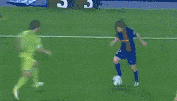</a>

Getafe, 2007 — the pattern, read early

:::
::::

::: {.notes}
A crowd-pleaser — use it to make prediction concrete and human. Let the clip loop and talk over it: Getafe, 2007, the goal everyone calls his best. Watch what he is actually doing — he is not outrunning them, he is arriving where the defenders are about to be. Every one of them is reacting to the present; he is playing the next half-second. That is prediction, wearing a shirt. Same move as a chess master seeing patterns rather than calculating every branch. That's the predictive engine from the spine, specialized. Read the caveat aloud — the growth-hormone-to-genius story is a nice narrative, not established science, and being honest about that models the intellectual care I'm asking of them.
:::

---

## Emotion → Feeling → Sentiment

:::: {.columns}
::: {.column width="55%"}
- **Emotion** — raw input; a valence signal: good or bad, now?
- **Feeling** — the conscious experience of that input
- **Sentiment** — a compressed label from expressed feelings
- Machine analogues: reward signals, then sentiment analysis
:::
::: {.column width="45%"}
<a href="https://en.wikipedia.org/wiki/Inside_Out_(2015_film)" target="_blank" rel="noopener" style="text-decoration:none;">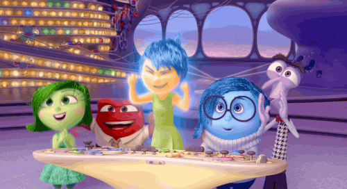</a>
:::
::::

::: {.notes}
Walk the chain: emotion is the raw valence signal (good/bad, now), feeling is the conscious experience of it, sentiment is the compressed label we express and others read. The machine mapping is the memorable bit: a reward signal is an emotion analogue with no feeling attached, and "sentiment analysis" reads the label without any of the experience underneath. Fluency without qualia, again.
:::

---

## Friston: Prediction Under Uncertainty

:::: {.columns}
::: {.column style="width:46%; font-size:0.9em;"}
- The brain predicts the world, not just records it
- Free Energy Principle: minimize surprise
- Consciousness as ongoing active inference
:::
::: {.column width="54%"}

<svg viewBox="0 0 280 178" width="100%" style="max-width:355px" font-family="sans-serif">
<defs>
<marker id="bay" markerWidth="8" markerHeight="8" refX="6" refY="3" orient="auto">
<path d="M0,0 L6,3 L0,6 Z" fill="#9aa0aa"/>
</marker>
</defs>
<text x="51" y="16" fill="#7aa0e0" font-size="9.5" text-anchor="middle">prior</text>
<rect x="8" y="22" width="86" height="58" rx="6" fill="#2b2f36" stroke="#7aa0e0"/>
<path d="M14,72 C30,72 28,48 51,48 C74,48 72,72 88,72" fill="none" stroke="#7aa0e0" stroke-width="1.6"/>
<line x1="96" y1="51" x2="122" y2="51" stroke="#9aa0aa" stroke-width="1.4" marker-end="url(#bay)"/>
<text x="140" y="16" fill="#63b3a6" font-size="9" text-anchor="middle">likelihood</text>
<circle cx="140" cy="51" r="14" fill="#2b2f36" stroke="#63b3a6"/>
<text x="140" y="56" fill="#63b3a6" font-size="13" text-anchor="middle">×</text>
<line x1="140" y1="94" x2="140" y2="68" stroke="#63b3a6" stroke-width="1.4" marker-end="url(#bay)"/>
<text x="140" y="106" fill="#b9bdc6" font-size="8.5" text-anchor="middle">sense data</text>
<line x1="156" y1="51" x2="184" y2="51" stroke="#9aa0aa" stroke-width="1.4" marker-end="url(#bay)"/>
<text x="231" y="16" fill="#f0a868" font-size="9.5" text-anchor="middle">posterior</text>
<rect x="188" y="22" width="86" height="58" rx="6" fill="#2b2f36" stroke="#f0a868"/>
<path d="M194,72 L212,72 C222,72 224,36 231,36 C238,36 240,72 250,72 L268,72" fill="none" stroke="#f0a868" stroke-width="1.6"/>
<path d="M231,80 L231,142 L51,142 L51,84" fill="none" stroke="#9aa0aa" stroke-width="1.3" stroke-dasharray="4 3" marker-end="url(#bay)"/>
<text x="141" y="156" fill="#b9bdc6" font-size="8.5" text-anchor="middle">becomes the next prior · t → t+1</text>
<text x="141" y="170" fill="#8b919a" font-size="8" text-anchor="middle">belief sharpens as evidence accumulates</text>
</svg>
:::
::::

:::: {style="font-size:0.6em; margin-top:0.1em;"}
$$\underset{\color{#f0a868}{\textbf{posterior}}}{\color{#f0a868}{P(\text{world} \mid \text{sense})}} \;\;\propto\;\; \underset{\color{#63b3a6}{\textbf{likelihood}}}{\color{#63b3a6}{P(\text{sense} \mid \text{world})}} \;\;\cdot\;\; \underset{\color{#7aa0e0}{\textbf{prior}}}{\color{#7aa0e0}{P(\text{world})}}$$
::::

::: {.notes}
This closes Section I and is the keystone for the whole talk. Friston's Free Energy Principle: the brain is not a passive recorder, it's a prediction machine constantly minimizing surprise between what it expects and what it senses. Don't derive the equation — just name it as Bayes' rule: the posterior belief about the world is the prior updated by sensory evidence. Plant the flag here: prediction is the common thread from cortex to transformer, and I'll cash this out after coffee.

Walk the loop once, left to right, and let the colours do the work — they match the equation underneath. Start with a prior: a broad, uncommitted belief about the world. Multiply by the likelihood, which is what the senses say. Out comes a posterior: the same belief, sharper. Then the move that matters, the dashed arrow: that posterior *becomes the next prior*, and the loop runs again. Note the two curves are the same claim drawn twice — the prior is a fat bump, the posterior a narrow spike. Perception isn't a snapshot; it's this loop, running continuously, all the way down.

If someone asks why "free energy" rather than just Bayes: free energy is the quantity you minimise to make this loop tractable when the exact posterior is out of reach. Say that, then stop — the maths past that point is a lecture of its own.
:::

---

## II. Human Intelligence as Machine Learning {.section-divider}

---

## Human Intelligence Properties

- Short-Term and Long-Term Memory
- Sample Efficiency — learn from a few examples
- Generalization & Transfer
- Compositionality & Abstraction
- Causal Reasoning, Metacognition, Grounding

::: {.notes}
This list is doing double duty — tell the audience to remember it, because in Section VII I read the exact same list back as the AGI wish-list. Sample efficiency is the one to underline: a child learns "giraffe" from one picture; a model needs thousands. Every item here is a capability our biology already has and our machines mostly don't.
:::

---

## Supervised Learning

:::: {.columns}
::: {.column width="56%"}
- Map inputs → labeled outputs
- Told the answer; adjust to cut error
- Bottleneck: the cost of labels
- Human parallel: a student with an answer key
:::
::: {.column width="44%"}
<svg viewBox="0 0 260 200" width="100%" style="max-width:340px" font-family="sans-serif">
  <defs>
    <marker id="ar" markerWidth="8" markerHeight="8" refX="6" refY="3" orient="auto">
      <path d="M0,0 L6,3 L0,6 Z" fill="#9aa0aa"/>
    </marker>
  </defs>
  <rect x="14" y="40" width="58" height="34" rx="6" fill="#2b2f36" stroke="#b9bdc6"/>
  <text x="43" y="61" fill="#e6e6e9" font-size="11" text-anchor="middle">input x</text>
  <rect x="100" y="40" width="60" height="34" rx="6" fill="#2b2f36" stroke="#f0a868"/>
  <text x="130" y="61" fill="#f0a868" font-size="11" text-anchor="middle">model</text>
  <rect x="188" y="40" width="58" height="34" rx="6" fill="#2b2f36" stroke="#b9bdc6"/>
  <text x="217" y="61" fill="#e6e6e9" font-size="11" text-anchor="middle">ŷ</text>
  <line x1="72" y1="57" x2="98" y2="57" stroke="#9aa0aa" stroke-width="1.5" marker-end="url(#ar)"/>
  <line x1="160" y1="57" x2="186" y2="57" stroke="#9aa0aa" stroke-width="1.5" marker-end="url(#ar)"/>
  <rect x="188" y="120" width="58" height="34" rx="6" fill="#2b2f36" stroke="#63b3a6"/>
  <text x="217" y="141" fill="#63b3a6" font-size="11" text-anchor="middle">label y</text>
  <line x1="217" y1="120" x2="217" y2="76" stroke="#9aa0aa" stroke-width="1.5" marker-end="url(#ar)"/>
  <text x="235" y="100" fill="#b9bdc6" font-size="9">error</text>
  <path d="M188,137 C120,137 120,80 132,76" fill="none" stroke="#e06c75" stroke-width="1.4" stroke-dasharray="4 3" marker-end="url(#ar)"/>
  <text x="120" y="120" fill="#b9bdc6" font-size="9" text-anchor="middle">adjust</text>
  <text x="130" y="185" fill="#b9bdc6" font-size="9" text-anchor="middle">the answer key supervises</text>
</svg>
:::
::::

::: {.notes}
The most intuitive paradigm, so move briskly. Every training example comes with its correct answer; the model adjusts to shrink the error. The bottleneck is the real teaching point — labels are expensive, they need humans — and that cost is exactly why the field pivoted to the next slide, self-supervision.
:::

---

## Self-Supervised Learning

:::: {.columns}
::: {.column width="56%"}
- Data supplies its own labels — predict the masked word
- The engine behind foundation models
- The internet becomes supervision, unannotated
- Human parallel: an infant learning by observation
:::
::: {.column width="44%"}
<svg viewBox="0 0 260 200" width="100%" style="max-width:340px" font-family="sans-serif">
  <defs>
    <marker id="ar2" markerWidth="8" markerHeight="8" refX="6" refY="3" orient="auto">
      <path d="M0,0 L6,3 L0,6 Z" fill="#9aa0aa"/>
    </marker>
  </defs>
  <text x="14" y="41" fill="#e6e6e9" font-size="11" text-anchor="start">the cat sat on the</text>
  <rect x="113" y="24" width="30" height="24" rx="4" fill="#2b2f36" stroke="#f0a868" stroke-dasharray="3 2"/>
  <text x="128" y="41" fill="#f0a868" font-size="13" text-anchor="middle">?</text>
  <text x="252" y="41" fill="#b9bdc6" font-size="9" text-anchor="end">hide a token</text>
  <line x1="128" y1="52" x2="129" y2="98" stroke="#9aa0aa" stroke-width="1.5" marker-end="url(#ar2)"/>
  <rect x="95" y="102" width="70" height="34" rx="6" fill="#2b2f36" stroke="#f0a868"/>
  <text x="130" y="123" fill="#f0a868" font-size="11" text-anchor="middle">model</text>
  <line x1="130" y1="136" x2="130" y2="158" stroke="#9aa0aa" stroke-width="1.5" marker-end="url(#ar2)"/>
  <rect x="108" y="160" width="44" height="26" rx="5" fill="#2b2f36" stroke="#63b3a6"/>
  <text x="130" y="177" fill="#63b3a6" font-size="12" text-anchor="middle">"mat"</text>
  <text x="235" y="176" fill="#b9bdc6" font-size="9" text-anchor="end">it is the label</text>
</svg>
:::
::::

::: {.notes}
This is the one that unlocked the LLM era, so give it weight. The trick: hide part of the data and make the model predict it — no human labels needed, the data supervises itself. Suddenly the entire internet becomes training signal. Tie it straight back to Friston: predicting the masked word is the same move as the brain predicting its next sensory input. Same principle, silicon substrate.
:::

---

## Unsupervised Learning

:::: {.columns}
::: {.column width="56%"}
- No labels — find structure in the data itself
- Clustering, dimensionality reduction, density estimation
- Reveals hidden groupings and manifolds
- Human parallel: noticing categories no one named
:::
::: {.column width="44%"}
<svg viewBox="0 0 240 200" width="100%" style="max-width:320px" font-family="sans-serif">
  <ellipse cx="62" cy="60" rx="42" ry="34" fill="#f0a868" opacity="0.08" stroke="#f0a868" stroke-dasharray="4 3"/>
  <ellipse cx="170" cy="70" rx="40" ry="32" fill="#63b3a6" opacity="0.08" stroke="#63b3a6" stroke-dasharray="4 3"/>
  <ellipse cx="110" cy="150" rx="46" ry="32" fill="#7aa0e0" opacity="0.08" stroke="#7aa0e0" stroke-dasharray="4 3"/>
  <g fill="#f0a868">
    <circle cx="48" cy="52" r="4"/><circle cx="70" cy="46" r="4"/><circle cx="60" cy="66" r="4"/><circle cx="78" cy="70" r="4"/><circle cx="52" cy="74" r="4"/><circle cx="66" cy="58" r="4"/>
  </g>
  <g fill="#63b3a6">
    <circle cx="158" cy="62" r="4"/><circle cx="178" cy="58" r="4"/><circle cx="170" cy="76" r="4"/><circle cx="186" cy="74" r="4"/><circle cx="162" cy="82" r="4"/><circle cx="182" cy="66" r="4"/>
  </g>
  <g fill="#7aa0e0">
    <circle cx="96" cy="144" r="4"/><circle cx="116" cy="140" r="4"/><circle cx="108" cy="158" r="4"/><circle cx="126" cy="156" r="4"/><circle cx="100" cy="162" r="4"/><circle cx="120" cy="148" r="4"/>
  </g>
  <text x="120" y="192" fill="#b9bdc6" font-size="10" text-anchor="middle">clusters emerge — no labels given</text>
</svg>
:::
::::

::: {.notes}
Keep this short — it's the setup for the "unifying view" two slides on. No labels at all; the algorithm finds structure the data already contains: clusters, low-dimensional manifolds, density. The human parallel is the nice one: noticing categories before anyone gave them names. Don't dwell; the modern action is in self-supervised and RL.
:::

---

## Reinforcement Learning

:::: {.columns}
::: {.column width="56%"}
- Learn from reward and consequence
- Powers game-players and chat-model tuning
- The agent generates its own training signal
- Human parallel: a child learning by trial, reward, and consequence
:::
::: {.column width="44%"}
<svg viewBox="0 0 300 200" width="100%" style="max-width:340px" font-family="sans-serif">
  <defs>
    <marker id="ar3" markerWidth="8" markerHeight="8" refX="6" refY="3" orient="auto">
      <path d="M0,0 L6,3 L0,6 Z" fill="#9aa0aa"/>
    </marker>
  </defs>
  <rect x="90" y="24" width="120" height="38" rx="8" fill="#2b2f36" stroke="#f0a868" stroke-width="2"/>
  <text x="150" y="48" fill="#f0a868" font-size="12" text-anchor="middle">Agent</text>
  <rect x="90" y="138" width="120" height="38" rx="8" fill="#2b2f36" stroke="#b9bdc6"/>
  <text x="150" y="162" fill="#e6e6e9" font-size="12" text-anchor="middle">Environment</text>
  <path d="M206,62 C246,80 246,120 206,138" fill="none" stroke="#9aa0aa" stroke-width="1.6" marker-end="url(#ar3)"/>
  <text x="268" y="103" fill="#b9bdc6" font-size="10" text-anchor="middle">action</text>
  <path d="M94,138 C54,120 54,80 94,62" fill="none" stroke="#63b3a6" stroke-width="1.6" marker-end="url(#ar3)"/>
  <text x="28" y="98" fill="#63b3a6" font-size="10" text-anchor="middle">state</text>
  <text x="28" y="111" fill="#63b3a6" font-size="10" text-anchor="middle">+ reward</text>
</svg>
:::
::::

::: {.notes}
No fixed dataset — the agent acts, gets reward or penalty, and generates its own training signal. This is what beat the world at Go and, more to the point, it's the "RLHF" tuning that turned a raw next-token predictor into a helpful chatbot. Flag the connection: this is the second half of the recipe I'm about to name. A child learning a hot stove is the whole idea in one image.
:::

---

## Unifying View

- Self-supervised prediction builds the world model
- Reinforcement fine-tunes on top
- The same recipe in human brain and in models

::: {.notes}
Section II landing. Compress the whole section to one sentence: self-supervised prediction builds the world model, reinforcement fine-tunes it on top — and that two-stage recipe is how you train a frontier LLM and, plausibly, how the cortex works too. This is the boldest claim of the section, so state it as a claim, not a fact. It sets up Section III's question: if this is all "just" prediction, what do we even mean by "AI"?
:::

---

## III. "AI": An Ambiguous Term {.section-divider}

---

## Beginning: Dartmouth, 1956

:::: {.columns}
::: {.column width="62%"}

- McCarthy chose "artificial intelligence"
- The conjecture: intelligence can be *"so precisely described that a machine can be made to simulate it"*
- They thought a summer and 10 assistants would do it.
:::
::: {.column width="38%"}

<figure style="margin:0; text-align:center;">

<figcaption style="font-size:0.32em;opacity:.75;margin:0.1em 0 0 0;line-height:1;">McCarthy</figcaption>
</figure>
<figure style="margin:0; text-align:center;">
<a href="https://en.wikipedia.org/wiki/Marvin_Minsky" target="_blank" rel="noopener" style="text-decoration:none;">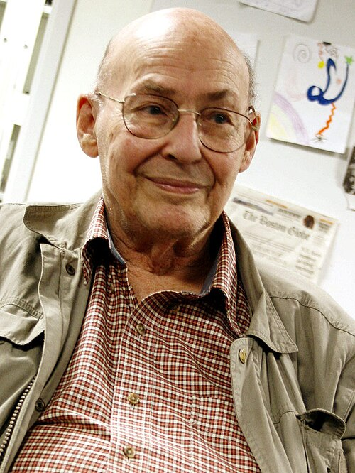</a>
<figcaption style="font-size:0.32em;opacity:.75;margin:0.1em 0 0 0;line-height:1;">Minsky</figcaption>
</figure>
<figure style="margin:0; text-align:center;">
<a href="https://en.wikipedia.org/wiki/Claude_Shannon" target="_blank" rel="noopener" style="text-decoration:none;">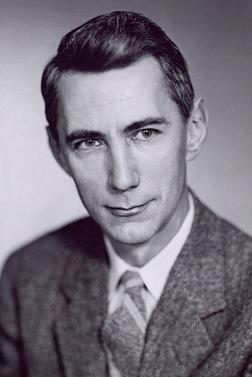</a>
<figcaption style="font-size:0.32em;opacity:.75;margin:0.1em 0 0 0;line-height:1;">Shannon</figcaption>
</figure>

with Nathaniel Rochester — the four who signed the 1955 proposal

:::
::::

::: {.notes}
The origin story, and it is evidence for the whole section — so tell it as evidence, not trivia. Summer 1956, Dartmouth College: a six-week workshop proposed the year before by McCarthy, Minsky, Rochester and Shannon. It is conventionally the founding moment of the field.

The detail that matters is the second bullet, and it is the reason this slide exists: McCarthy picked the words "artificial intelligence" because they were *neutral* — he wanted to avoid being annexed by cybernetics and its analog-feedback framing, and he wanted to avoid a fight with Norbert Wiener, who was formidable. So the name of our entire discipline was a political choice made to dodge a rival school and a difficult colleague, before there was any science to name. That is the ambiguity thread with a birth certificate: "AI" was a label first and a field second.

Land the last bullet lightly — about twenty people passed through, daily attendance ran three to eight, and only Solomonoff, Minsky and McCarthy stayed the whole summer. The founding event of the field was a loosely-attended summer workshop, not a moment of revelation.
:::

---

## Four Acronyms

:::: {style="font-size:0.86em;"}
- **ML** — algorithms that improve at a task with more data
- **ANI** — narrow: superhuman at one task, useless outside it
- **AGI** — general: human-level breadth, *novel* tasks included
- **ASI** — beyond: exceeds the best humans at essentially everything
::::

<a href="https://en.wikipedia.org/wiki/Artificial_general_intelligence" target="_blank" rel="noopener" style="text-decoration:none;">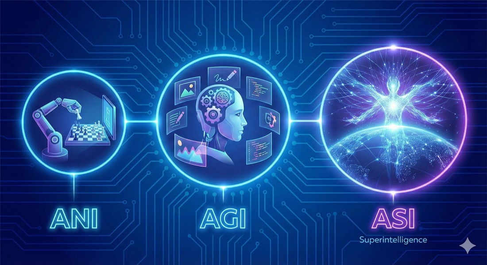</a>

ANI is here · AGI is the aspiration · ASI is the artwork

::: {.notes}
Pause here and pin the vocabulary down — the rest of the talk depends on these four not blurring together. ML is the method: systems that improve from data rather than hand-coded rules; it powers everything on this slide. ANI is what we actually have — chess engines, translators, LLMs: superhuman in a lane, helpless outside it. AGI is the aspiration — human-level breadth, and stress the word *novel*: problems it wasn't trained for. ASI is the speculation beyond that; mention it once, don't let the talk drift into sci-fi. Use the picture against itself for that — notice that ANI gets a robot arm playing chess (a real thing that exists), AGI gets a humanoid juggling tasks (a hope), and ASI gets a glowing cosmic figure rising over the Earth (a painting). The artwork escalates exactly as the evidence evaporates. That is the whole slide's caution in one image, and it lets you make the point with a smile rather than a lecture. The trap to name out loud: "AI" in headlines slides between all four. When someone says AI, ask which one they mean — that's the ambiguity thread again.
:::

---

## Make Coffee

:::: {.columns}
::: {.column width="58%"}
- Functionalist test: a machine does what a human did — intelligent?
- Once we see the mechanism, we stop calling it AI
- Chess, OCR, translation — "AI" until it worked
- Make coffee in any kitchen in the world
- "AI" often means: *not yet understood*
:::
::: {.column width="42%"}
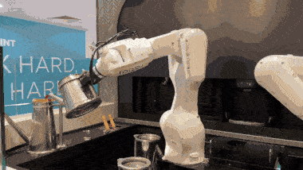

Coffee, yes — but in a rig built for it, not <em>any</em> kitchen

:::
::::

::: {.notes}
This is the "AI effect" and the emotional centre of the section. The pattern: chess, OCR, translation were all "AI" right up until they worked — then we saw the mechanism and demoted them to "just software." "Make coffee in any unfamiliar kitchen" (Wozniak's test) is the vivid version of a task still on the far side of that line. Use the clip against itself: yes, that arm makes coffee — but look where. It is a fixed barista rig built around the machine, every cup and spout in a known spot. That is the easy half of Wozniak's test. The hard half — walking into a stranger's kitchen and finding the beans — is exactly what no robot can do, and the gap between the two is the whole point. Land the punchline: "AI" too often just labels whatever we don't yet understand — a moving goalpost, not a category. This directly teases the thesis slide.
:::

---

## Turing Test

:::: {.columns}
::: {.column width="60%"}
- Imitation: indistinguishable in text → passes
- Says nothing about internal states
- Cited often, engineered against rarely
- A floor, not a ceiling
:::
::: {.column width="40%"}
[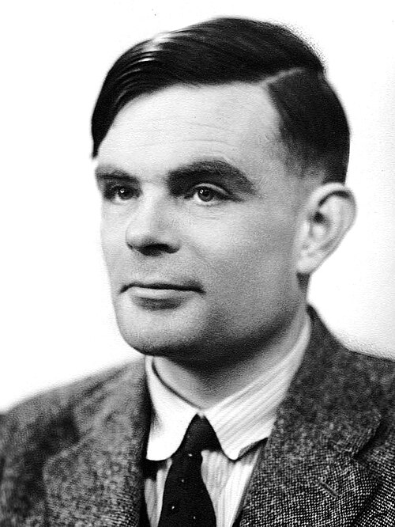{width="78%" style="border-radius:10px;"}](https://en.wikipedia.org/wiki/Alan_Turing){target="_blank" rel="noopener"}
:::
::::

::: {.notes}
Turing sidestepped "can machines think?" by replacing it with a behavioural test: if you can't tell it from a human in text, it passes. Two honest criticisms: it says nothing about internal states (the Chinese Room objection), and it's cited constantly but almost never actually engineered toward. The verdict to voice: a useful floor for the conversation, never a ceiling — and arguably modern chatbots pass it while being nobody's idea of AGI.
:::

---

## Russell & Norvig: Agents

:::: {.columns}
::: {.column width="54%"}
- Act to achieve the best expected outcome
- The textbook definition — agent, environment, measure
- Says nothing about *how* — only that it decides well
:::
::: {.column width="46%"}
<svg viewBox="0 0 270 200" width="100%" style="max-width:350px" font-family="sans-serif">
  <defs>
    <marker id="ar4" markerWidth="8" markerHeight="8" refX="6" refY="3" orient="auto">
      <path d="M0,0 L6,3 L0,6 Z" fill="#9aa0aa"/>
    </marker>
  </defs>
  <rect x="18" y="70" width="86" height="40" rx="8" fill="#2b2f36" stroke="#f0a868" stroke-width="2"/>
  <text x="61" y="95" fill="#f0a868" font-size="12" text-anchor="middle">Agent</text>
  <rect x="166" y="70" width="90" height="40" rx="8" fill="#2b2f36" stroke="#b9bdc6"/>
  <text x="211" y="95" fill="#e6e6e9" font-size="11" text-anchor="middle">Environment</text>
  <path d="M104,82 C135,72 138,72 164,80" fill="none" stroke="#9aa0aa" stroke-width="1.6" marker-end="url(#ar4)"/>
  <text x="134" y="66" fill="#b9bdc6" font-size="10" text-anchor="middle">action</text>
  <path d="M166,100 C138,110 135,110 106,100" fill="none" stroke="#63b3a6" stroke-width="1.6" marker-end="url(#ar4)"/>
  <text x="134" y="124" fill="#63b3a6" font-size="10" text-anchor="middle">percepts</text>
  <rect x="5" y="150" width="112" height="34" rx="8" fill="#2b2f36" stroke="#e0b062" stroke-dasharray="4 3"/>
  <text x="61" y="166" fill="#e0b062" font-size="8" text-anchor="middle">utility /</text>
  <text x="61" y="177" fill="#e0b062" font-size="8" text-anchor="middle">performance measure</text>
  <line x1="61" y1="150" x2="61" y2="112" stroke="#9aa0aa" stroke-width="1.5" marker-end="url(#ar4)"/>
  <text x="128" y="170" fill="#b9bdc6" font-size="9">what it maximizes</text>
</svg>
:::
::::

::: {.notes}
The definition most working engineers actually use — it's the frame of the Russell & Norvig textbook nearly everyone in AI trained on. An agent perceives an environment and acts to maximize an expected performance measure. Its strength is that it's operational and buildable; its silence is deliberate — it says nothing about consciousness or "how," only that the agent decides well. Contrast with Turing: behaviour-plus-goals rather than behavior-mimics-human.
:::

---

## Chollet: Intelligence as Adaptation

:::: {.columns}
::: {.column width="60%"}
- Efficiency at acquiring *new* skills
- Adaptation, not static performance
- The machine echo of human skill acquisition
- Memorize well, adapt poorly → not intelligent
:::
::: {.column width="40%"}
[{width="80%" style="border-radius:10px;"}](https://fchollet.com/){target="_blank" rel="noopener"}
:::
::::

::: {.notes}
Chollet is the counterweight to Sutton, and the definition closest to my own spine. Intelligence isn't static performance — it's skill-acquisition efficiency: how fast you turn a little experience into competence on genuinely new problems. This is where his ARC benchmark comes from, and why LLMs, which memorize spectacularly, score poorly on it. Connect it explicitly back to "sample-efficient novel problem solving" from the opening. Memorize well but adapt poorly, and you're not intelligent.
:::

---

## One Definition of Knowledge

- **Data** — raw, uncompressed
- **Compression** — redundancy found
- **Abstraction** — the reusable structure it yields
- **Prediction** — the test on unseen data
- **Knowledge** — abstraction that keeps passing

Process **data** to generate **knowledge**

::: {.notes}
Walk the pipeline slowly, it's the backbone of the section: raw data, compress out the redundancy, the reusable structure that survives is abstraction, the test is prediction on unseen data, and knowledge is abstraction that keeps passing that test. The key idea, and it echoes Friston: to know something is to compress it well enough to predict. Knowledge is compression that predicts.
:::

---

## Knowledge as Compression

- Deriving signal from noise
- **Genes** — survival encoded by evolution
- **Experience** — direct interaction
- **Culture** — collective wisdom, transmitted
- **Computers** — synthesis at scale

::: {.notes}
Four substrates that all run the same compression algorithm on different timescales: genes compress survival over evolutionary time, experience over a lifetime, culture across generations, and computers now do it at planetary scale in months. The through-line: each is prediction encoded into a different medium. Computers are just the newest, fastest substrate for an ancient process — which reframes LLMs as continuous with biology, not alien to it.
:::

---

## ☕ Coffee Break

*15 minutes — please join us in the foyer*

::: {.notes}
Housekeeping: state the exact return time out loud and point to the foyer. Good moment to take a sip of water and check the clock — if you're running long, the tribes section (V) is the most compressible — Section VI is load-bearing, so don't cut there. Restart after the break by re-anchoring the four spine threads before diving into generative AI.
:::

---

## IV. Generative AI & LLMs {.section-divider}

---

## What Gen AI Is

:::: {.columns}
::: {.column width="56%"}
- Simulation from a partially learned distribution; produces new samples
- Text, image, audio, code
- Self-supervised pre-training + the transformer
- System 1 at planetary scale
:::
::: {.column width="44%"}
<figure style="margin:0; text-align:center;">
  <a href="https://en.wikipedia.org/wiki/Diffusion_model" target="_blank" rel="noopener" style="text-decoration:none;">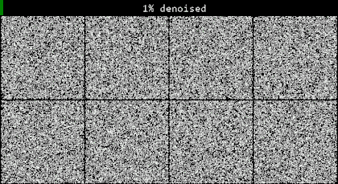</a>
  <figcaption style="font-size:0.3em;opacity:.55;margin:0.2em 0 0 0;line-height:1.3;">Noise → sample: a diffusion model inventing characters</figcaption>
</figure>
:::
::::

::: {.notes}
Welcome them back from coffee, re-anchor quickly. Generative AI learns a probability distribution over data and samples new points from it — text, image, audio, code, all the same trick. Two ingredients did it: self-supervised pre-training plus the transformer. The phrase to plant, because it pays off two slides later: this is "System 1 at planetary scale" — fast, fluent, intuitive pattern-completion, with no deliberate reasoning behind it yet.

Let it loop while you talk — it is the first bullet happening in front of them. The counter runs from 1% to 99% denoised: the model starts from pure noise and walks it, step by step, into a sample. That is what "simulation from a learned distribution" means, and no equation lands it as fast.

The detail worth pausing on: these are not real Chinese characters. The model learned the *distribution* of characters — strokes, radicals, balance, the way they sit in a square — and drew new ones from it. They look right to anyone who doesn't read Chinese, and wrong to anyone who does. That is generative AI in one image: fluent in the form, indifferent to the meaning. It also pre-loads "What Gen AI Is Not," the next slide — fluency is not knowledge.
:::

---

## What Gen AI Is Not

- No guarantee of truth, cause, or grounding
- Fluency is not knowledge
- It compresses culture and lets us query it
- New and powerful — not a mind

::: {.notes}
The deliberate counterweight to the hype slide before it — keep the tone measured, not dismissive. No guarantee of truth, cause, or grounding; fluency is not knowledge (this is where hallucination lives). The generous framing: it compresses human culture and lets us query it in natural language, which is genuinely new and genuinely powerful. But hold the line — powerful tool, not a mind. Both halves are true at once.
:::

---

## The LLM

:::: {.columns}
::: {.column width="58%"}
- A next-token predictor over human text
- No persistent memory, weak causal models
- Unreliable deliberate reasoning
- A statistical reflection of us
:::
::: {.column width="42%"}
<figure style="margin:0; text-align:center;">
  <a href="https://en.wikipedia.org/wiki/Attention_(machine_learning)" target="_blank" rel="noopener" style="text-decoration:none;">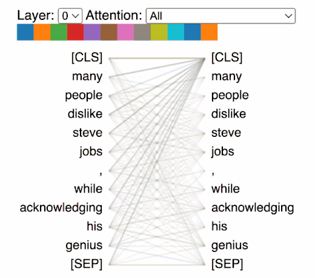</a>
  <figcaption style="font-size:0.3em;opacity:.55;margin:0.2em 0 0 0;line-height:1.3;">Attention, layer by layer — every token weighing every other</figcaption>
</figure>
:::
::::

::: {.notes}
The most precise technical description in the deck — slow down and be exact, some of the audience are specialists. Strip it to the mechanism: an LLM predicts the next token over human text, nothing more. From that fall the real limits — no persistent memory across sessions, weak causal models, unreliable multi-step reasoning. Close on the resonant line: it's a statistical reflection of us, our text mirrored back. That framing sets up the entire "state of the art" gaps section.

Let the animation loop while you talk — it is attention itself, every token weighing every other, layer by layer. Point at the crossing lines and say: that is the entire mechanism. No memory, no plan, no model of the world — weighted lookups over the context window, stacked a few dozen times. Everything the machine knows, it knows by re-reading its own input.

One caveat, and concede it fast if a specialist raises it: this is BertViz, so the tokens are BERT's — [CLS] and [SEP] — and BERT is a *masked* model, not a next-token predictor. The attention mechanism is identical; only the masking differs. If that trade bothers you, the alternative is an architecture diagram, which is more precise and much less alive.
:::

## V. The Five Tribes {.section-divider}

---

## Symbolists — Logic and Deduction

:::: {.columns}
::: {.column style="width:52%; font-size:0.74em;"}
- Roots: logic — Newell & Simon's symbol system hypothesis
- Learning = inverse deduction; rules, trees, expert systems
- Precise and auditable — but brittle
- Optimization: combinatorial search over rule/hypothesis space
- Modern echo: neuro-symbolic AI, formal verification
- EXAMPLE: Routing Email Complaints
:::
::: {.column width="48%"}
<a href="https://en.wikipedia.org/wiki/Decision_tree_learning" target="_blank" rel="noopener" style="text-decoration:none;">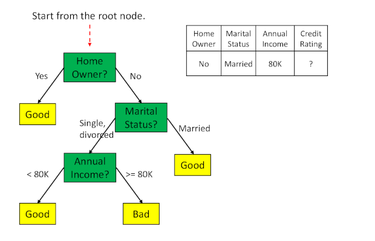</a>

Every answer comes with its own audit trail

Josh Tenenbaum

:::
::::

::: {.notes}
Framing for the whole section — this is Pedro Domingos' "five tribes" from The Master Algorithm. The symbolists came first: intelligence is the manipulation of symbols by explicit rules, and learning is inverse deduction — inferring the rules from examples. Their systems are precise and auditable, which is exactly why they're brittle when reality doesn't fit the rules. The email example: a rule tree that routes complaints by keywords — transparent, but it shatters on a phrasing nobody wrote a rule for. Modern echo: neuro-symbolic AI and formal verification.

Let the tree animation loop and use it for the third bullet — it is the tribe's whole case in one picture. A record walks the tree, and at every node you can see exactly which rule fired and why: home owner, marital status, income, verdict. That is what "auditable" means, and not one neural network in this deck can show you that. Then turn it over in the same breath: the rigidity *is* the brittleness. The tree has no answer for a record it was never given a branch for — it cannot hedge, it cannot guess, it just falls off the end.
:::

---

## Connectionists — Brain Inspired

:::: {.columns}
::: {.column width="66%"}
- Roots: McCulloch–Pitts (1943), Rosenblatt's perceptron (1958)
- Backpropagation (1986) → CNNs → transformers
- Optimization: stochastic gradient descent via backpropagation
- Scales with data and compute — and dominates today
- EXAMPLE: Making DNA viral capsids
:::
::: {.column width="34%"}
<a href="https://en.wikipedia.org/wiki/Neuron" target="_blank" rel="noopener" style="text-decoration:none;">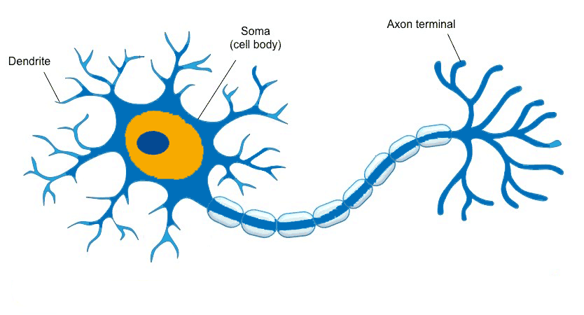</a>

Dendrites in, axon out — the unit they copied

  <figure style="margin:0; text-align:center;">
    <a href="https://www.cs.toronto.edu/~hinton/" target="_blank" rel="noopener" style="text-decoration:none;">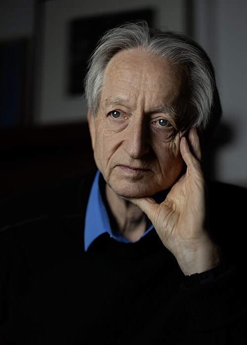</a>
    <figcaption style="font-size:0.36em;opacity:.85;margin:0.1em 0 0 0;line-height:1;">Hinton</figcaption>
  </figure>
  <figure style="margin:0; text-align:center;">
    
    <figcaption style="font-size:0.36em;opacity:.85;margin:0.1em 0 0 0;line-height:1;">LeCun</figcaption>
  </figure>
  <figure style="margin:0; text-align:center;">
    <a href="https://yoshuabengio.org/" target="_blank" rel="noopener" style="text-decoration:none;">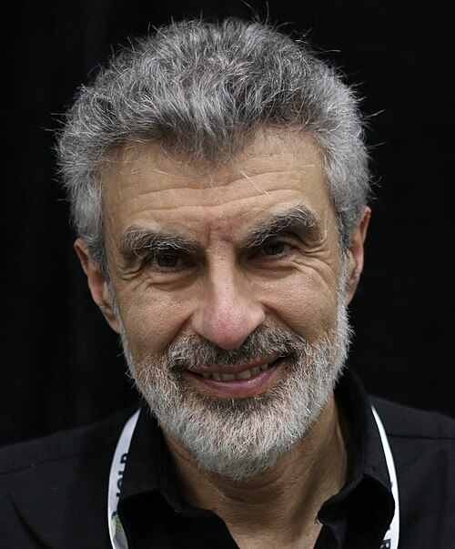</a>
    <figcaption style="font-size:0.36em;opacity:.85;margin:0.1em 0 0 0;line-height:1;">Bengio</figcaption>
  </figure>
  <figure style="margin:0; text-align:center;">
    <a href="https://people.idsia.ch/~juergen/" target="_blank" rel="noopener" style="text-decoration:none;">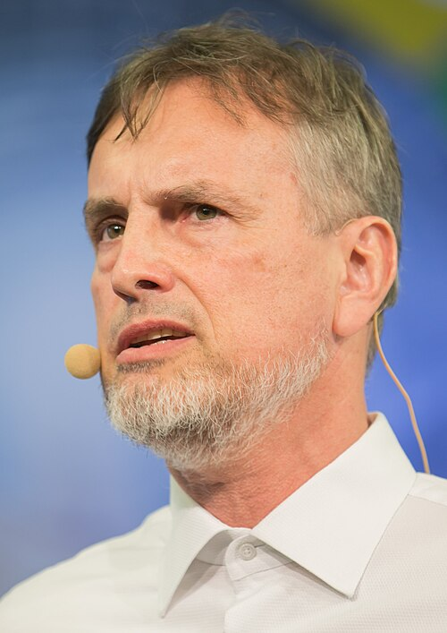</a>
    <figcaption style="font-size:0.36em;opacity:.85;margin:0.1em 0 0 0;line-height:1;">Schmidhuber</figcaption>
  </figure>

:::
::::

::: {.notes}
The tribe that won — for now. Point at the neuron loop for one beat before you start: dendrites collect, the soma sums, the axon fires — that is the whole biological unit, and the 1943 model is a shameless cartoon of exactly it. Everything since is that cartoon, stacked. Inspiration is the brain: McCulloch–Pitts neurons in 1943, Rosenblatt's perceptron in 1958, then backpropagation in 1986 unlocked deep nets → CNNs → transformers. The engine is stochastic gradient descent. Why it dominates: it scales with data and compute, which is Sutton's bitter lesson made flesh. The capsid example: neural nets designing viral protein shells for gene therapy — learning the sequence-to-structure map no human could hand-code. This connects straight to the LLMs from Section IV.
:::

---

## Connectionists: Bolivarian Contribution

:::: {.columns}
::: {.column width="54%"}
- Two inspiring contributors from the Bolivarian nations!
:::
::: {.column width="46%"}
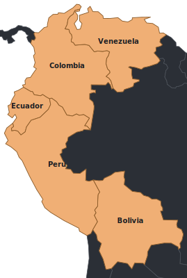{style="height:370px;"}
:::
::::

::: {.notes}
Personal / local-connection slide — a nod to the host country and its researchers. Fill in the two names and their contributions before the talk, and say a warm sentence about each; this is a moment to connect with the room, not to teach. Keep it short and generous, then move back to the tribes.

The five on the map are the Bolivarian nations — Venezuela, Colombia, Ecuador, Peru, Bolivia — the republics Bolívar liberated. Deliberately not "Gran Colombia," which was a different and shorter-lived thing (Colombia, Venezuela, Ecuador and Panama, 1819–1831). If someone raises it, that distinction is worth conceding cheerfully rather than defending.
:::

---

## Evolutionaries — Selection Algorithm

:::: {.columns}
::: {.column style="width:66%; font-size:0.74em;"}
- Roots: Darwin, formalized by Holland (1975)
- Evolve a population — mutation, crossover, selection
- No gradient, no labels — only a fitness score
- Optimization: genetic algorithms / evolutionary search
- Niche but creative: architecture search, robot morphology
- EXAMPLE: Avoiding immune response for gene envelope
:::
::: {.column width="34%"}

  <figure style="margin:0;text-align:center;">
    <a href="https://en.wikipedia.org/wiki/John_Henry_Holland" target="_blank" rel="noopener" style="text-decoration:none;">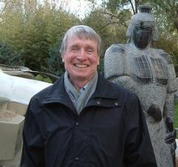</a>
    <figcaption style="font-size:0.32em;opacity:.55;margin:0.15em 0 0 0;line-height:1.2;">John H. Holland</figcaption>
  </figure>
  <figure style="margin:0;text-align:center;">
    <a href="https://en.wikipedia.org/wiki/Genetic_algorithm" target="_blank" rel="noopener" style="text-decoration:none;">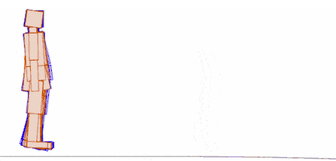</a>
    <figcaption style="font-size:0.3em;opacity:.55;margin:0.12em 0 0 0;line-height:1.2;">An evolved gait — most of the population falls over</figcaption>
  </figure>
  <figure style="margin:0;text-align:center;">
    <a href="https://en.wikipedia.org/wiki/Simulated_annealing" target="_blank" rel="noopener" style="text-decoration:none;">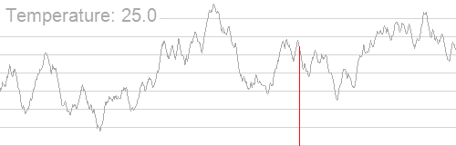</a>
    <figcaption style="font-size:0.3em;opacity:.55;margin:0.12em 0 0 0;line-height:1.2;">Simulated annealing — escaping local optima</figcaption>
  </figure>

:::
::::

::: {.notes}
Darwin as algorithm, formalized by Holland in 1975. Use the walker: every one of those figures is a candidate gait, and almost all of them fall over. Nobody told any of them what walking is — there is no label, no gradient, only a score for how far you got before you hit the ground. Keep the winners, mutate, repeat. That is the whole tribe in one loop, and it is also why it is slow. You keep a population of candidate solutions and apply mutation, crossover, and selection against a fitness score — no gradient, no labels, just "did it work better?" That makes it the tool of choice when the problem is non-differentiable or you can't even write down the objective: neural architecture search, evolving robot body shapes. The example ties back to the capsid: evolving a gene-therapy envelope that slips past the immune system, an objective too messy for gradients. Niche today, but genuinely creative.
:::

---

## Bayesians — Belief as Probability

:::: {.columns}
::: {.column style="width:74%; font-size:0.68em;"}
- Roots: Bayes (1763), Laplace
- Learning = updating a distribution over hypotheses
- Prior + likelihood → posterior
- Optimization: probabilistic inference (MCMC, variational inference)
- Calibrated uncertainty, at a computational cost
- EXAMPLE: Soldier Death Benefit Pensions
:::
::: {.column width="26%"}
[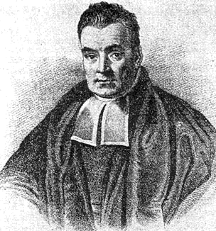{width="76%" style="border-radius:8px;"}](https://en.wikipedia.org/wiki/Bayes%27_theorem){target="_blank" rel="noopener"}
:::
::::

:::: {style="font-size:0.5em; margin-top:0.15em;"}
$$\underset{\color{#f0a868}{\text{posterior}}}{\color{#f0a868}{P(H \mid D)}} \;=\; \frac{\underset{\color{#63b3a6}{\text{likelihood}}}{\color{#63b3a6}{P(D \mid H)}}\;\cdot\;\underset{\color{#7aa0e0}{\text{prior}}}{\color{#7aa0e0}{P(H)}}}{\underset{\color{#9aa0aa}{\text{evidence}}}{\color{#9aa0aa}{P(D)}}}$$
::::

:::: {style="font-size:0.46em; margin-top:-0.3em;"}
$$\underset{\color{#e06c75}{\text{predictive}}}{\color{#e06c75}{P(x^{*} \mid D)}} \;=\; \int \color{#63b3a6}{P(x^{*} \mid H)}\; \color{#f0a868}{P(H \mid D)}\; dH \qquad \text{— average over every hypothesis, don't pick one}$$
::::

::: {.notes}
The tribe that takes uncertainty seriously. Roots in Bayes (1763) and Laplace: learning is updating a probability distribution over hypotheses — prior plus likelihood gives posterior. Inference is the hard part (MCMC, variational methods), and the payoff is calibrated uncertainty: the model tells you how sure it is, at real computational cost. The pension example is the point of the tribe — actuarial estimates of survivor benefits where being honestly uncertain matters more than a single confident guess, and a wrong point estimate has human consequences. Note LLMs borrow this for uncertainty estimates.
:::

---

## Analogizers — Similarity

:::: {.columns}
::: {.column style="width:66%; font-size:0.8em;"}
- Roots: psychology — reasoning from prior cases
- k-nearest neighbors, SVMs, the kernel trick
- Optimization: constrained optimization to maximize margin (SVMs)
- Legacy: recommendation, few-shot via embeddings
- EXAMPLE: Locating outperforming stock pairs
:::
::: {.column width="34%"}

<a href="https://en.wikipedia.org/wiki/Vladimir_Vapnik" target="_blank" rel="noopener" style="text-decoration:none;">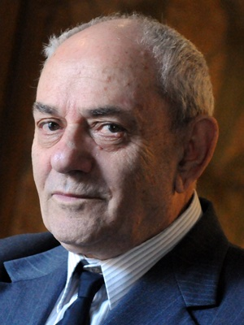</a>

Vladimir Vapnik — co-inventor of the SVM

<a href="https://en.wikipedia.org/wiki/Support_vector_machine" target="_blank" rel="noopener" style="text-decoration:none;">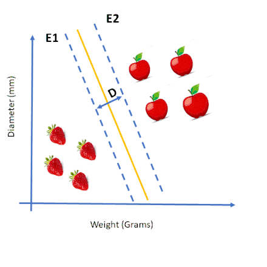</a>

The margin, widened until it cannot be

:::
::::

::: {.notes}
The fifth tribe: reason by similarity to past cases rather than by rules or models. Roots in psychology; the workhorses are k-nearest neighbours and SVMs, whose kernel trick measures similarity in high-dimensional space. The legacy is everywhere — recommendation systems ("people like you"), and few-shot learning via embeddings, which is how modern LLMs retrieve. The stock example: pairs trading, finding two stocks that historically move together and betting on the gap when they diverge — pure reasoning from analogous past behaviour. Set up the synthesis slide next: today's systems quietly use all five.

The flag is a callback to Dartmouth, and worth thirty seconds. Vapnik and Chervonenkis built statistical learning theory — VC dimension, the margin, eventually the SVM — in Moscow through the 1960s and 70s, at an institute for control sciences, under the disciplinary banner of *cybernetics*. That is the very word McCarthy picked "artificial intelligence" to avoid. So the same intellectual territory got two names on two sides of the Iron Curtain, and the Western half spent decades not reading the Eastern half: VC theory only really landed here after Vapnik came to Bell Labs around 1990. The point for the ambiguity thread: the name a field carries is an accident of politics, and it determines who reads you.

The animation is the tribe's actual idea: two classes, and infinitely many lines that separate them — the SVM picks the one that sits as far from both as possible. Widen the margin until it jams. Say that the margin is not a detail, it is the whole theory: Vapnik's claim was that the widest gap is the one that generalises, and he had the proof, not just the intuition.
:::

---

## The Frontier Borrows From All Five

- No production system is one tribe
- LLMs: connectionist core, Bayesian uncertainty, symbolic tools, RL tuning
- Domingos' provocation: one master algorithm?
- Which synthesis will *your* work advance?

::: {.notes}
Section V landing, and the first direct address to the doctoral candidates. No real production system is a single tribe — a modern LLM is a connectionist core with Bayesian uncertainty, symbolic tool use bolted on, and RL for tuning. Domingos' provocation: is there one "master algorithm" that unifies all five? I don't claim there is. End on the question aimed straight at the room — which synthesis will your thesis push forward? Let it sit before the section break.
:::

---

## VI. State of the Art {.section-divider}

---

## Brittle AI & the Reasoning Gap

- Narrow, brittle outside the training distribution
- The frontier problem is reasoning, not scale
- Performance can mask absent understanding
- The \$1M ARC Prize still stands — no system has claimed it

  <a href="https://arcprize.org/" target="_blank" rel="noopener" style="text-decoration:none;">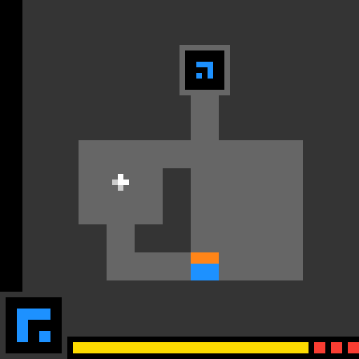</a>
  <a href="https://arcprize.org/leaderboard" target="_blank" rel="noopener" style="text-decoration:none;">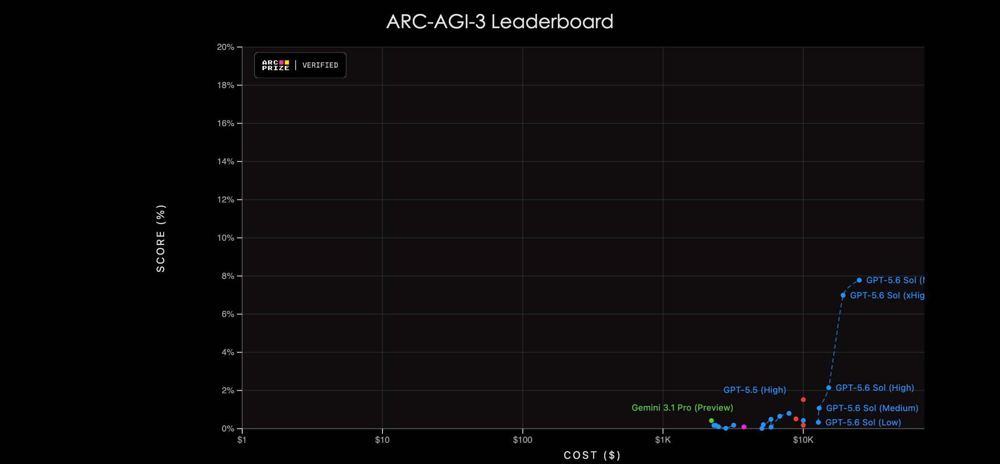</a>

::: {.notes}
Set the honest tone for Section VI — this is the reality check after the tribes. Today's systems are narrow and brittle the moment you step outside the training distribution. The reframe that matters: the frontier problem is reasoning, not scale — more parameters won't close this gap. And the warning to the researchers in the room: benchmark performance can mask a total absence of understanding, so measure carefully and distrust a single headline number. The animation is an ARC-AGI puzzle being solved — gesture at it when you name the reasoning gap: a child infers the rule from two or three examples, and this family of tasks is precisely where frontier models still fall over. Then point at the leaderboard: on ARC-AGI-3 the best frontier systems sit under 8%, and only by spending thousands of dollars per run — the score axis tops out at 20% and the cost axis is logarithmic. That one chart is the whole slide in numbers. And the last bullet is the stakes made concrete — the \$1M ARC Prize for a system that cracks these tasks efficiently is still unclaimed; the gap isn't rhetorical, it's a standing bounty nobody has collected.
:::

---

## System 1 vs. System 2

:::: {.columns}
::: {.column width="62%"}
- After Kahneman: fast intuition vs. slow reasoning
- LLMs excel at System 1, stumble at System 2
- "Reasoning" models narrow the gap at inference time
- Open and fast-moving
:::
::: {.column width="38%"}
[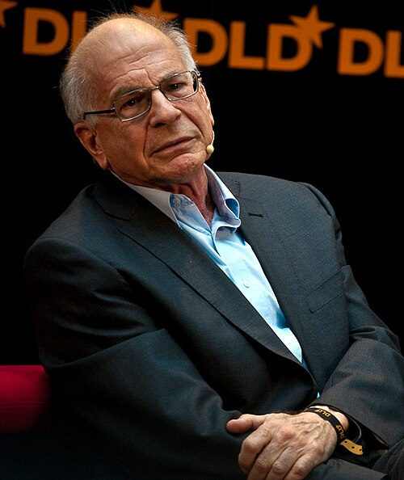{width="80%" style="border-radius:10px;"}](https://en.wikipedia.org/wiki/Daniel_Kahneman){target="_blank" rel="noopener"}
:::
::::

::: {.notes}
Kahneman's framing, borrowed and made concrete — this is the payoff of the "System 1 at planetary scale" line I planted in Section IV. System 1 is fast, automatic, intuitive; System 2 is slow, effortful, deliberate. LLMs are astonishing System 1 and stumble at System 2. The current move — chain-of-thought and "reasoning" models that spend more compute at inference time — is an attempt to bolt on System 2. Flag it as genuinely open and moving fast: whatever I say here may be dated by the time you watch the recording.
:::

---

## Reality Gets a Vote

- Knowledge is what survives a test
- Code and maths moved fastest — they can be **checked**
- Fluency with no verifier → hallucination
- Essays, strategy, taste, most real tasks: no oracle

::: {.notes}
Define your sense of "grounding" out loud, because the word is overloaded. Philosophers use it for how symbols get their meaning — Harnad, the Chinese Room; that's Section I's question and I'm not asking it here. I mean the engineering sense: does anything check the answer? Note that this is the same move as Section III — name the ambiguity, pick a definition, hold to it. The line to land is the second bullet: a model trained only on text has never once been told it was wrong by the world.
:::

---

## Pearl's Ladder

:::: {.columns}
::: {.column width="62%"}
- **See** — P(y | x)
- **Do** — P(y | do(x))
- **Imagine** — what if I had?
- LLMs just see, no doing or imagining without a verifier!
- Can't watch your way to cause
:::
::: {.column width="38%"}
[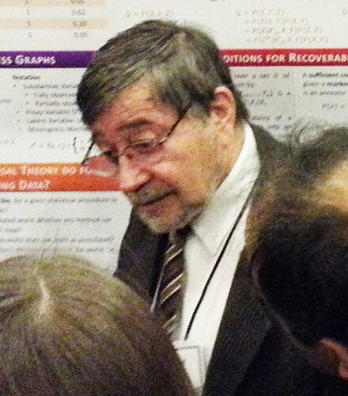{width="76%" style="border-radius:10px;"}](http://bayes.cs.ucla.edu/jp_home.html){target="_blank" rel="noopener"}
:::
::::

::: {.notes}
Pearl's *Book of Why* in one slide — don't derive anything. Three rungs: seeing is association, which is where all of statistics and machine learning lives; doing is intervention; imagining is counterfactual. Say the do-operator aloud once so it's not just notation. The punchline is the last bullet: everything we have praised tonight sits on rung one.

The photo is Pearl at NeurIPS, standing at his own poster — the notation behind his shoulder is the graphical-model machinery this slide is compressing. Worth one sentence if the room is warm.
:::

---

## The Experiment Is the Intervention

- **do(x)** — reach in, *set* x by hand, cutting its usual causes
- That severed graph is what an experiment *is* — randomise, don't just watch
- **Verifying and causing are one move**
- To do experiments and find cause, you need a body

<a href="https://en.wikipedia.org/wiki/Causal_inference" target="_blank" rel="noopener" style="text-decoration:none;">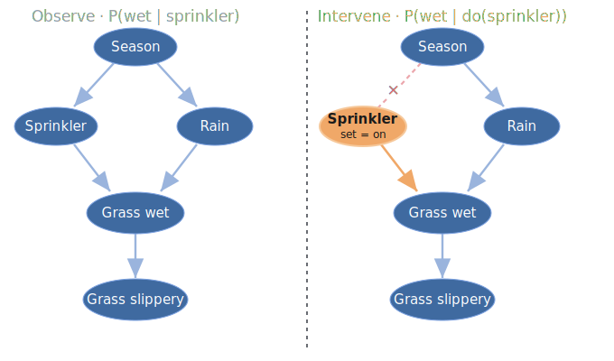</a>

::: {.notes}
The unification, and the bridge out of this section. An experiment is literally an intervention — do(x) is what you are doing when you randomise. Walk the two graphs: on the left you only *observe* the sprinkler, so seeing it on also tells you the season, and the season told the rain — the correlation is contaminated. On the right you *do* it: forcing the sprinkler on cuts the arrow from Season, so nothing upstream explains it away, and what reaches the wet grass is pure cause. That severed edge is the whole idea of the do-operator. So the verifier from *Reality Gets a Vote* and the ladder we have just walked are the same idea seen twice: reality only answers when you act on it. That is why Section VIII turns to bodies. Land the last bullet slowly; it is the hinge of the back half.
:::

---

## VII. What We Want from AGI {.section-divider}

---

## Generality, Efficiency, Reasoning

- **Generality** — competence transfers to the untrained
- **Sample Efficiency** — human-like, from few examples
- **Robust Reasoning** — multi-step, causal, self-correcting

::: {.notes}
First three requirements. Generality means competence transfers to tasks it was never trained on — the opposite of the brittleness in Section VI. Sample efficiency is the spine's yardstick again: human-like learning from a handful of examples, not millions. Robust reasoning is multi-step, causal, and self-correcting — the System 2 the models still lack. Point out each one is a direct answer to a gap named earlier; this isn't a wish-list from nowhere.
:::

---

## Memory, Grounding, Aligned Autonomy

- **Persistent Memory** — no catastrophic forgetting
- **Grounded World Models** — causal, ideally embodied
- **Autonomy + Alignment** — open-ended yet controllable
- The last is a constraint — and the highest-stakes one

::: {.notes}
The remaining three, and slow down on the last. Persistent memory means no catastrophic forgetting — the missing piece from "The LLM." Grounded world models means causal, ideally embodied understanding, which sets up Section VIII. Then the crucial asymmetry: alignment isn't another capability, it's a constraint on all the others — we want open-ended autonomy that stays controllable. It's the only item where getting it wrong is catastrophic rather than merely disappointing, which is why it carries the most weight.
:::

---

## VIII. The Future {.section-divider}

---

## Embodied AI & Moravec's Paradox

- Intelligence may require a body
- Moravec: reasoning is cheap, sensorimotor skill is dear
- Crossing a room is harder than grandmaster chess

::: {.notes}
Open the future section with the counterintuitive one. Moravec's paradox: the things evolution spent hundreds of millions of years on — walking, grasping, perceiving — are the hard ones for machines, while chess, which we find hard, is comparatively easy. A toddler's sensorimotor skill outstrips any robot; grandmaster chess fell decades ago. The provocation: real intelligence may require a body, because so much of our cognition is built on sensorimotor grounding. This teases the robotics slide next.
:::

---

## Foundation Models Meet Robotics

:::: {.columns}
::: {.column width="58%"}
- Model "brains" in capable "bodies"
- Surgery, deep-sea exploration, autonomous logistics
- The loop closes: sense → predict → act → learn
- Where the next decade concentrates
:::
::: {.column width="42%"}
<a href="https://www.unitree.com/g1" target="_blank" rel="noopener" style="text-decoration:none;">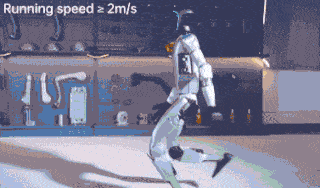</a>

Unitree G1 — a body waiting for a better brain

:::
::::

::: {.notes}
This is where I place my bet on the next decade. Let the robot loop — it is a Unitree G1, a genuinely capable body you can buy today, and it is the point of the whole slide: the hardware has arrived, the brain has not. Sensorimotor competence is nearly solved; what it lacks is the grounded, causal world-model from Section VI. That gap is the bet. Put the foundation-model "brain" into a capable "body" — surgery, deep-sea and space exploration, autonomous logistics. The unifying idea is the closed loop: sense, predict, act, learn — which is Friston's active inference and the RL loop from Section II, now running in the physical world. Tell the candidates plainly: this is where I'd concentrate, the convergence of foundation models and robotics. But hold it lightly — a bet, not a prophecy.
:::

---

## AI Ethics — Beyond My Expertise

- **Cheap Dopamine** — engineered attention capture
- **Economic Effects** — labour, wealth concentration
- **Children** — growing up AI-saturated
- **Distribution** — who reaps the fruits of the technology
- A prior, held lightly: fewer regulations tend to serve better

::: {.notes}
Handle with humility — say out loud that this is outside my expertise, because it is, and the honesty matters more than coverage. Name the stakes without pretending to resolve them: engineered attention capture ("cheap dopamine"), labour disruption and wealth concentration, children growing up AI-saturated, and who actually captures the benefits. The regulation line is a personal prior, explicitly held lightly — flag it as a view to argue with, not a conclusion, and invite disagreement in the discussion. Don't linger or preach.
:::

---

## Key Takeaways

- "AI" is an ambiguous term — today it means LLMs
- Minds run on prediction — octopus to cortex to transformer
- Human intelligence is the ML task list, written first in our biology
- The open gaps — reasoning, memory, grounding, alignment — are the agenda

::: {.notes}
The recap — tie the spine threads together one last time so they leave with them. "AI" is ambiguous and today means LLMs; minds run on prediction, from octopus to cortex to transformer; human intelligence is the ML task list written first in biology. Then land the fourth bullet as the handoff: the open gaps aren't failures of the field, they're the research agenda — reasoning, memory, grounding, alignment. Slow down; this is the last content slide before the personal close.
:::

---

## Closing Remarks

*This PhD program is not about mastering today's tools — it is about building the future.*

You are the architects of the world models that will define the coming decade. The questions left open tonight — what consciousness is, how memory should persist, what closes the reasoning gap, what we should and should not want from AGI — are not gaps in this lecture.

**They are your thesis directions.**

::: {.notes}
The emotional close — slow right down, make eye contact, let the last line breathe before you say it. The message: a PhD isn't about mastering today's tools, which will be obsolete, but about interrogating the definitions themselves — the callback to the very first slide. Reframe every open question from tonight (consciousness, memory, the reasoning gap, what we should want from AGI) not as gaps in the lecture but as their thesis directions. Pause fully after the bold line, then move to references and discussion.
:::

---

## Key References I

*Foundations & cognition*

- Turing, A. (1950). Computing Machinery and Intelligence. *Mind*.
- Russell, S. & Norvig, P. (2020). *Artificial Intelligence: A Modern Approach* (4th ed.)
- Kahneman, D. (2011). *Thinking, Fast and Slow*.
- Friston, K. (2010). The free-energy principle: a unified brain theory? *Nature Reviews Neuroscience*.

---

## Key References II

*Symbolic & neural roots*

- Newell, A. & Simon, H. (1976). Computer science as empirical inquiry: symbols and search. *CACM*.
- McCulloch, W. & Pitts, W. (1943). A logical calculus of ideas immanent in nervous activity.
- Rosenblatt, F. (1958). The perceptron. *Psychological Review*.
- Minsky, M. & Papert, S. (1969). *Perceptrons*.

---

## Key References III

*Learning at scale*

- Rumelhart, D., Hinton, G. & Williams, R. (1986). Learning representations by back-propagating errors. *Nature*.
- Vaswani, A. et al. (2017). Attention Is All You Need. *NeurIPS*.
- Hinton, G., Bengio, Y. & LeCun, Y. — 2018 ACM A.M. Turing Award, for deep neural networks
- Dean, J. et al. (2012). Large scale distributed deep networks. *NeurIPS*.

---

## Key References IV

*Defining intelligence*

- Holland, J. (1975). *Adaptation in Natural and Artificial Systems*.
- Sutton, R. (2019). *The Bitter Lesson*.
- Chollet, F. (2019). On the measure of intelligence. *arXiv:1911.01547*.
- Domingos, P. (2015). *The Master Algorithm*.
- Moravec, H. (1988). *Mind Children*.

---

## Image Credits

:::: {.columns}
::: {.column style="width:50%; font-size:0.42em; opacity:0.75; line-height:1.32;"}
- Bonobo — natataek, CC BY-SA 3.0
- Octopus — Diego Delso, CC BY-SA 4.0
- L. Messi goal clip (Getafe, 2007) — broadcast footage, rights holder unidentified
- Mirror self-recognition (bear, infant, child animations) — via Medium
- G. Hinton — Cmichel67, CC BY-SA 4.0
- Y. LeCun — J. Barande, CC BY-SA 2.0
- Y. Bengio — Xuthoria, CC BY-SA 4.0
- J. Schmidhuber — ITU/R. Farrell, CC BY 2.0
- D. Kahneman — nrkbeta, CC BY-SA 2.0
- J. Pearl — Better Than Bacon, CC BY 2.0
- J. McCarthy — null0, CC BY-SA 2.0
- M. Minsky — OLPC, CC BY 3.0
- C. Shannon — Tekniska museet, CC BY 2.0
- F. Chollet — Ramosset, CC BY-SA 4.0
- A. Turing — Elliott & Fry, public domain
- T. Bayes — public domain (attribution disputed)
- Soviet flag — public domain
:::
::: {.column style="width:50%; font-size:0.42em; opacity:0.75; line-height:1.32;"}
- Simulated annealing — Kingpin13, CC0
- Map boundaries — Natural Earth, public domain
- J. Holland, V. Vapnik, J. Tenenbaum, K. Friston — no free licence identified; used under fair dealing for education
- Rodin's *The Thinker* animation — via Giphy, unattributed
- Attention animation — BertViz, via comet.com
- Diffusion denoising animation — via Towards Data Science
- Decision tree animation — via Medium
- *Inside Out* emotions clip — © Disney/Pixar, via Medium; used under fair dealing for education
- Biological neuron animation — via Telefónica Tech
- Evolved walker animation — via kottke.org
- SVM margin animation — via Medium
- ANI/AGI/ASI illustration — via Medium
- AI history timeline — via LinkedIn
- Unitree G1 robot animation — via roboticgizmos.com
- Coffee-making robot animation — via Mothership
- ARC-AGI task animation & ARC-AGI-3 leaderboard — © ARC Prize Foundation, via arcprize.org
:::
::::

::: {style="font-size:0.4em; opacity:0.6; margin-top:0.6em;"}
Photographs from Wikimedia Commons unless noted. Titled slide image: Piedras del Tunjo.
:::

::: {.notes}
Back-matter — don't present this, just let it exist. It's here so the CC BY and CC BY-SA images are properly attributed without cluttering the slides they appear on, which is the normal convention for a talk. The last line is the honest one: three portraits have no freely-licensed photograph in existence, and they're used under an educational rationale. If that ever becomes a problem, those three are the ones to pull.
:::

---

## Discussion

*What is the most important open problem in AI — and how will you spend the next five years on it?*

::: {.notes}
Open the floor and then wait — count to ten in silence if you have to; the first question is always the slowest. This prompt is deliberately personal and forward-looking to pull answers from the candidates rather than abstract debate. Have two or three seed questions ready in case the room is quiet, and be willing to say "I don't know" — modelling intellectual honesty is the whole point of the evening. Thank the audience and the hosts before closing.
:::
